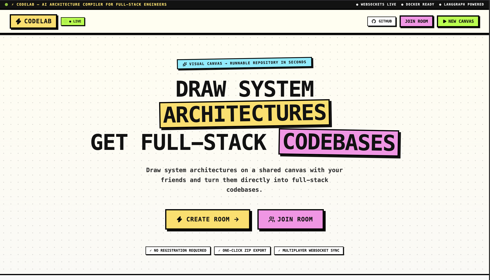
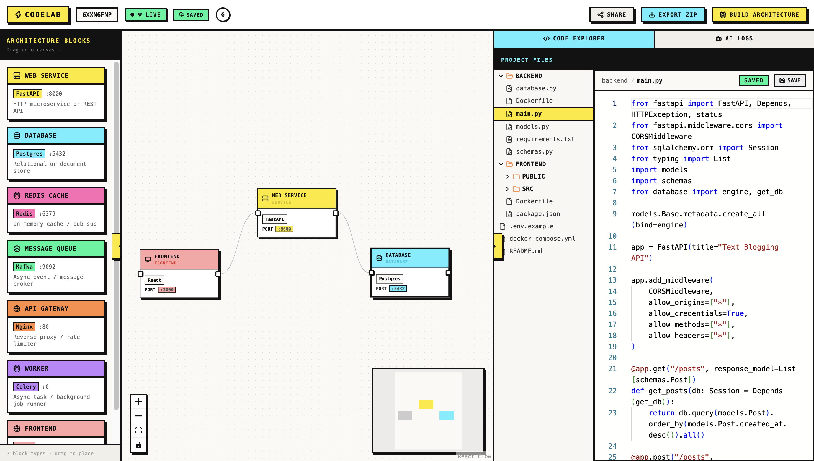

# CodeLab

> Draw system architectures on a collaborative whiteboard and turn them directly into production-ready full-stack starter codebases.




CodeLab is a real-time collaborative platform where developers can visually map out system designs—combining API gateways, web services, databases, caches, and queues—and scaffold complete multi-file project repositories with an integrated in-browser code editor and AI assistant.

---

## Key Features

* **Collaborative Architecture Canvas**: Multi-user whiteboard with live diagram synchronization, cursor tracking, and room passcode authorization.
* **Graph-to-Code Generation**: Converts visual node-and-edge system topologies into functional, structured boilerplate repositories (e.g., FastAPI, PostgreSQL, Redis, Celery, Docker configs).
* **Asynchronous Task Orchestration**: Background code generation powered by LangGraph, Celery, and Redis to handle deep LLM processing without blocking the UI.
* **Code Explorer & In-Browser Editor**: View generated project trees, inspect full source files, make direct in-editor edits, and save changes to the database.
* **Context-Aware AI Assistant**: Ask questions, request architectural explanations, or prompt incremental modifications to generated files.

---

## Tech Stack

* **Frontend**: React, TypeScript, React Flow, Monaco Editor, Tailwind CSS
* **Backend**: Django, Django REST Framework, Django Channels (ASGI WebSockets)
* **Async & AI Pipeline**: Celery, Redis, LangChain, LangGraph, Pydantic, Gemini / Groq API
* **Database & Cache**: PostgreSQL, Redis (pub/sub, state locks, task queues)

---

## System Architecture

```
+-----------------------------------------------------------------------------+
|                                Frontend (UI)                                |
+-----------------------------------------------------------------------------+
        |                     |                              |
 (HTTP REST API)       (WebSocket Sync)             (WebSocket Events)
        |                     |                              |
        v                     v                              v
+------------------+  +--------------------+        +--------------------+
|  Django REST API |  |   Django Channels  |        |    Celery Worker   |
| (CRUD, Triggers) |  |   WebSocket Layer  |        | (LangGraph Engine) |
+------------------+  +--------------------+        +--------------------+
        |                       |                            |
        +------------+----------+----------------------------+
                     |
                     v
        +----------------------------+
        |   PostgreSQL + Redis Layer |
        | (DB State, Locks, Channels)|
        +----------------------------+
```

---

## Getting Started

### Prerequisites

* Python 3.10+
* Node.js 18+
* Redis Server (`localhost:6379`)
* PostgreSQL (or SQLite for development)

---

### Backend Setup

1. **Clone the repository**:
   ```bash
   git clone [https://github.com/Shikhrrr/codelab.git](https://github.com/Shikhrrr/codelab.git)
   cd codelab
   ```

2. **Create and activate a virtual environment**:
   ```bash
   python -m venv venv
   source venv/bin/activate  # On Windows: venv\Scripts\activate
   ```

3. **Install Python dependencies**:
   ```bash
   pip install -r requirements.txt
   ```

4. **Set environment variables**:
   Create a `.env` file in the project root:
   ```env
   DEBUG=True
   SECRET_KEY=your_django_secret_key
   ALLOWED_HOSTS=*
   
   # Database & Redis
   REDIS_URL=redis://127.0.0.1:6379/0
   
   # AI Provider Keys
   GEMINI_API_KEY=your_gemini_api_key
   # or GROQ_API_KEY=your_groq_api_key
   ```

5. **Run database migrations**:
   ```bash
   python manage.py migrate
   ```

6. **Start the ASGI development server**:
   ```bash
   python manage.py runserver
   ```

7. **Start Celery background worker** (in a separate terminal):
   ```bash
   celery -A config worker -l info -P solo
   ```

---

### Frontend Setup

1. **Navigate to the frontend directory**:
   ```bash
   cd frontend
   ```

2. **Install Node dependencies**:
   ```bash
   npm install
   ```

3. **Configure frontend environment**:
   Create a `.env` or `.env.local` inside `frontend/`:
   ```env
   VITE_API_BASE_URL=http://localhost:8000/api
   VITE_WS_BASE_URL=ws://localhost:8000/ws/whiteboard
   ```

4. **Start the Vite development server**:
   ```bash
   npm run dev
   ```

---

## API & WebSocket Overview

| Method / Protocol | Endpoint | Description |
| :--- | :--- | :--- |
| `POST` | `/api/rooms/` | Create a new shared collaboration room |
| `GET` / `POST` | `/api/rooms/{id}/canvas/` | Fetch or persist current whiteboard nodes and edges |
| `POST` | `/api/rooms/{id}/generate/` | Trigger asynchronous architecture code scaffolding |
| `GET` / `PUT` | `/api/rooms/{id}/files/` | List all generated project files or update a specific file |
| `GET` | `/api/rooms/{id}/chat/` | Retrieve room AI discussion and modification history |
| `WSS` | `/ws/whiteboard/{id}/` | Real-time bidirectional canvas synchronization & generation events |

---

## License

Distributed under the MIT License. See `LICENSE` for more information.
